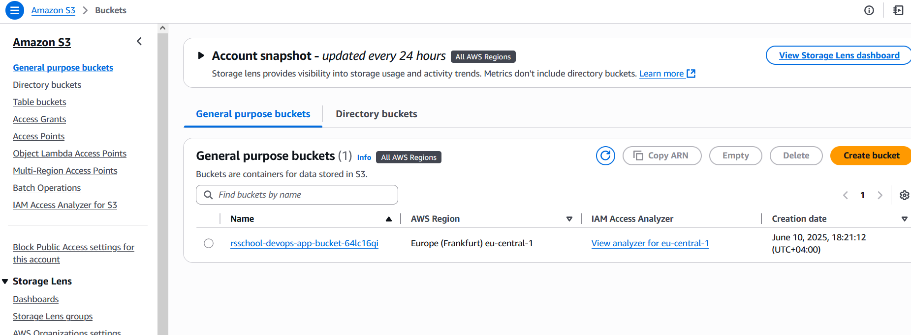
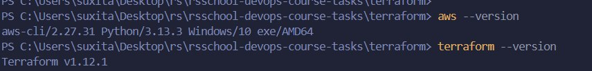
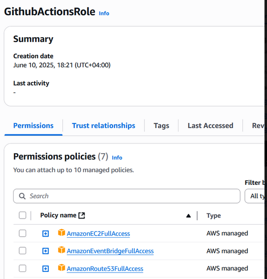
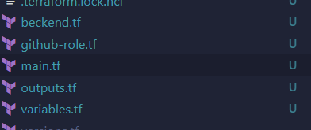

# RSSchool DevOps Course Tasks

## Task 1: 
Terraform configurations and GitHub Actions workflows for AWS infrastructure management 

#### criterias filefield:  

made **terraform-check**, **terraform-plan**, **terraform-apply**.

**terraform-check**:Validates Terraform formatting,Runs on all PRs and main pushes
**terraform-plan**: Creates deployment plan, Runs after format check
**terraform-apply**:Deploys infrastructure, Requires all previous jobs to pass.

**MFA User configured** 
user configured with every needed permissions as well as enabled and set mfa.
[img](img/user.png)

**s3 bucket created** 

**aws and terraform** 

  
**role created** 

**terraform aplying is done without errors**( says that nothing changed because its acctually second attempt, and i didnt screenshotted first, sorry for that :p).

**code is separated** 
